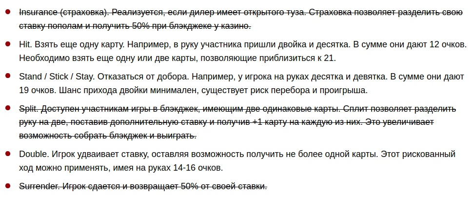
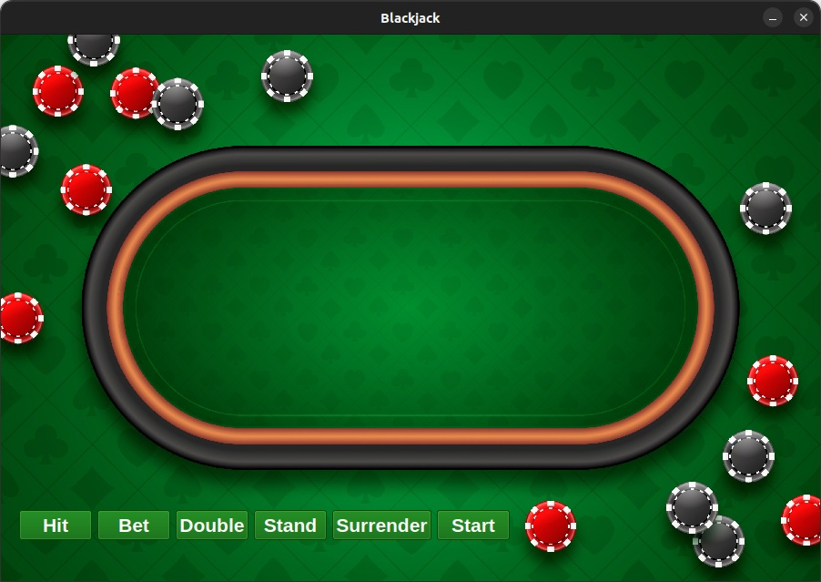

## Blackjack

### Написано на Python 3.10 с использованием PyQt.
#### Открывается в PyCharm)

> Для запуска из PyCharm необходимо выполнить первые два пункта из "Для запуска проекта", после чего в конфигурациях запуска IDE добавить Python конфигурацию со скриптом запуска [main.py](./main.py). Интерпретатор Python должен тянуться из папки [.venv](./.venv/)!!!

### Папки .venv, .git и прочие, не относящиеся непосредственно к коду проекта, будут удалены из конечной сборки, предоставленной на GoogleDrive!

Источники по дизайну ([здесь](./assets/)):
- [Игральные карты (колода, 54 шт.)](https://natomarcacini.itch.io/card-asset-pack)
- [Игровой покерный стол, фон](https://ru.freepik.com/free-vector/gradient-poker-table-background_94959238.htm#query=покерный%20стол&position=27&from_view=keyword&track=ais&uuid=5d25d603-a17c-4c9f-8edb-eaa34de26fe9)

При разработке проекта частичная ориентация была на правила игры Blackjack, [источник](https://www.shambalacasino.ru/blog/pravila-igri-v-blekdjek).

#### Зависимости:
> Все зависимые модули проекта указаны в файле [requirements.txt](./requirements.txt).

#### Для запуска проекта:
- Подготовьте виртуальное окружение (опционально) ```python3 -m venv .venv```
- - Активируйте окружение ```source .venv/bin/activate```
- Уставновите зависимости ```pip install -r requirements.txt```
- Запустите проект ```python3 main.py```

### Окружение не используется (не относится к виртуальному окружению python).

#### Описание проекта:
- [assets](./assets): используемые ассеты.
- - [cards](./assets/cards): изображения игральных карт.
- - - [card_back.png](./assets/cards/card_back.png): обложка игральной карты.
- - - [foreground](./assets/cards/foreground): лицевая сторона для всех игральных карт.
- - [background.jpg](./assets/background.jpg): игровое поле.
- [wingets](./widgets): директория с графическими элементами PyQt.
- - [game.py](./widgets/game.py): UX/UI приложения.
- - [helpers.py](./widgets/helpers.py): классы-помощники для польз. граф. эл. PyQt.
- [conf.json](./conf.json): конфигурация проекта.
- [config.py](./config.py): модуль для загрузки конфигурации проекта.
- [entities.py](./entities.py): модуль с основной логикой и сущностями игры Blackjack.
- [exceptions.py](./exceptions.py): модуль пользовательских исключений проекта.
- [main.py](./main.py): модуль запуска.

### Что было реализовано:


### Что можно было бы реализовать:
Вторая часть задания **[здесь](./readme/continue.txt)**

### Всё запустили, но как играть?
Само окно с игрой должно выглядеть примерно так:


Элементы управления состоят из следующих кнопок:
- Hit - Взять карту
- Bet - Сделать ставку
- Double - Удвоить ставку
- Stand - Не брать карту
- Surrender - Ничего не делает
- Start - Начать игру или новый раунд

Начинать игру следует только при первом запуске или после специального оповещения в виде диалогового окна о том,
что раунд был закончен с N-ым результатом.

Делать ставку можно согласно текущим требованиям. Первый раз ставка запрашивается при старте игры.

Удвоение считается за сделать ставку, однако после него карту можно брать только один раз.

Не брать карту в однопользовательской реализации - формально - закончить игру. После конца игры можно снова жмать
кнопку старт.